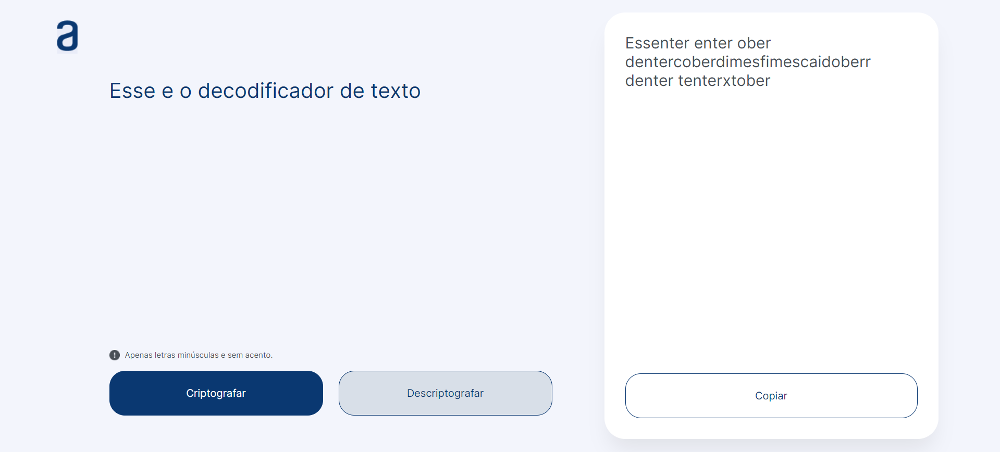

<h1 align="center">Decodificador de Texto</h1>

  <strong>🚀 Aqui você pode criar mensagens criptografadas e compartilhar com quem sabe o segredo 📚</strong>

  
Divirta-se 😄

    <a href="#-visão-do-projeto">Visão do projeto</a> •
    <a href="#-layout">Layout</a> • 
    <a href="#-tecnologias">Tecnologias</a> •
    <a href="#-instruções">Instruções</a> •
    <a href="#-autora">Autora</a>
 

## 🔭 Visão do projeto

O projeto foi desenvolvido com base no Challange ONE Alura, que desafia os alunos a porem em prática os assuntos trabalhados durante a formação Iniciante em Programação da Oracle Next Education. Nele, você pode criar mensagens para serem criptografadas e descriptografar com base nas regras estabelecidas na lógica e copiá-las ao final.

## 🎨 Layout
O design foi feito no [figma](https://www.figma.com/design/9LyAGVotr0egxXOmL87aA7/Alura-Challenge---Desafio-1---L%C3%B3gica?node-id=0-1&t=06syOP15PrZ5fAvN-0), confira para saber mais detalhes da página.

## 💻 Tecnologias

## ⚙️ Instruções

Você pode acessar a página do projeto [aqui](https://criptografar-descriptografar-lake.vercel.app/)

- Deve funcionar apenas com letras minúsculas.
- Não devem ser utilizados letras com acentos nem caracteres especiais.

## 🧙‍♂️ Autora

